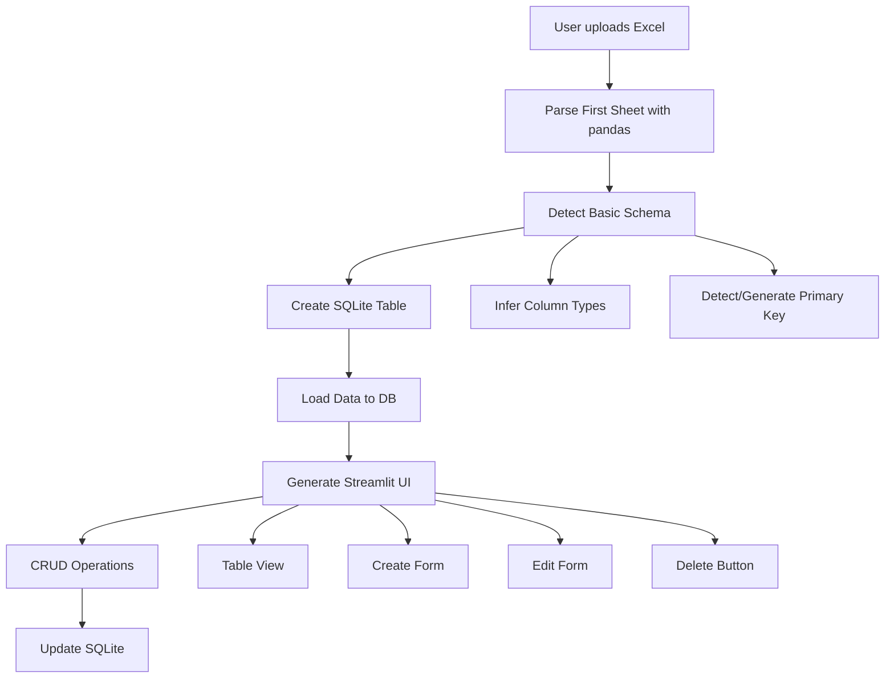

# Phase 1: Excel to Streamlit MVP - True Minimum Viable Product

## Overview

Create a minimal viable product that converts the first sheet of an Excel file into a Streamlit app with basic CRUD operations. Focus on core functionality: upload Excel → detect schema → store in SQLite → generate CRUD interface. No advanced features (multi-sheet, validation rules, formulas, charts) - those move to Phase 2.

## Architecture



## File Structure

```
excel-to-streamlit/
├── app.py                 # Main Streamlit application
├── src/                   # Source code modules
│   ├── __init__.py
│   ├── schema_detector.py # Basic schema detection (first sheet, types, PK)
│   ├── db_manager.py      # SQLite database operations (single table)
│   └── crud_generator.py  # Simple Streamlit UI generation (basic forms)
├── tests/                 # Unit tests
│   ├── __init__.py
│   ├── test_schema_detector.py
│   ├── test_db_manager.py
│   ├── test_crud_generator.py
│   ├── test_app.py        # Streamlit app tests using AppTest
│   └── fixtures/          # Test data files
│       ├── sample_data.xlsx
│       └── sample_data.xls
├── logs/                   # Application logs (gitignored)
│   └── .gitkeep
├── docs/                   # Documentation
│   ├── API.md            # API documentation
│   ├── ARCHITECTURE.md   # Architecture overview
│   └── DEVELOPMENT.md    # Development guide
├── requirements.txt          # Python dependencies
├── requirements-dev.txt     # Development dependencies (pytest, etc.)
├── .gitignore              # Git ignore rules (logs/, *.db, __pycache__, etc.)
├── pytest.ini              # Pytest configuration
└── README.md               # Setup instructions and overview
```

## Implementation Details

### 1. Dependencies

**Production (`requirements.txt`):**

- `streamlit` - Web app framework
- `pandas` - Excel parsing and data manipulation
- `openpyxl` - Excel file reading (.xlsx format)
- `xlrd` - Excel file reading (.xls legacy format)
- `sqlite3` - Database (built-in, but explicit in docs)

**Development (`requirements-dev.txt`):**

- `pytest` - Testing framework
- `pytest-cov` - Coverage reporting
- `black` - Code formatting
- `flake8` - Linting
- `mypy` - Type checking (optional)

### 2. Schema Detection (`src/schema_detector.py`)

- Read Excel file with pandas (uses openpyxl/xlrd under the hood)
- **Read first sheet only** (ignore other sheets for MVP)
- Infer column types from data:
  - `int` - integer numbers
  - `float` - decimal numbers
  - `str` - text strings
  - `date` - date/datetime values (Excel date format)
- Auto-detect primary key:
  - Check if first column is unique → use as PK
  - If not unique, auto-generate `id` column (integer, auto-increment)
- Return schema dictionary: `{columns: [...], types: {...}, primary_key: str}`
- **Logging**: Log schema detection steps, type inference results, PK detection
- **Error handling**: Catch pandas errors, log with context, raise custom exceptions

### 3. Database Manager (`db_manager.py`)

- Create SQLite database with single table (named `data` or from sheet name)
- Insert initial data from Excel first sheet
- Basic CRUD operations:
  - `create_record(data: dict)` - Insert new record
  - `read_all() -> pd.DataFrame` - Get all records
  - `update_record(id, data: dict)` - Update existing record
  - `delete_record(id)` - Delete record by ID
- Handle auto-generated primary key if needed

### 4. CRUD Generator (`src/crud_generator.py`)

- Generate simple Streamlit UI components:
  - **Table View**: `st.dataframe` with all records (editable inline if possible)
  - **Create Form**: `st.form` with dynamically generated inputs:
    - `st.text_input` for string columns
    - `st.number_input` for int/float columns
    - `st.date_input` for date columns
  - **Edit Form**: Pre-filled form with selected record (use session state to track selection)
  - **Delete Button**: With `st.button` and confirmation (use session state)
- Simple form validation (required fields, type checking)
- **Logging**: Log UI generation, form submissions, user interactions
- **Error handling**: Validate form inputs, show user-friendly error messages

### 5. Main App (`app.py`)

- File uploader for Excel (.xlsx, .xls) using `st.file_uploader`
- Basic file validation:
  - Check file extension
  - Check file size (< 50MB)
  - Try to open file (catch corruption errors)
- On upload:

  1. Detect schema (first sheet) → `schema_detector.py`
  2. Create DB table → `db_manager.py`
  3. Load data → `db_manager.py`

- Display:
  - Generated CRUD interface → `crud_generator.py`
  - Success message with record count
- Handle all user interactions (create, update, delete)
- Show error messages for failed operations

## Data Flow

1. **Upload**: User uploads `.xlsx` or `.xls` file
2. **Parse**: Read first sheet with pandas
3. **Detect Schema**: Infer column types and primary key (or generate one)
4. **Store**: Create single SQLite table and insert data
5. **Display**: Generate simple CRUD interface (table view, create/edit forms, delete)
6. **Interact**: User performs CRUD operations
7. **Persist**: All changes saved to SQLite

## Key Simplifications for MVP (Phase 1)

- **Single Excel file, first sheet only** (other sheets ignored)
- **SQLite database** (no PostgreSQL)
- **Manual schema detection** (no AI)
- **Basic type inference** (int, float, str, date)
- **Simple primary key** (first unique column or auto-generated `id`)
- **No relationships or foreign keys**
- **No authentication or multi-user support**
- **Single app instance** (no app management)
- **No data validation rules** (basic form inputs only)
- **No formula detection** (all columns editable)
- **No chart detection** (no visualizations)
- **Minimal edge case handling** (critical errors only)

## Phase 2: Enhanced Features (Deferred from MVP)

The following features are intentionally deferred to Phase 2 to keep MVP simple:

### Multi-Sheet Support

- Process all sheets in Excel file
- Generate tabs for each sheet/table
- Allow switching between tables

### Excel Feature Detection

- **Data Validation Rules**: Detect dropdowns, lists, numeric ranges → map to `selectbox`, `number_input` with constraints
- **Formula Detection**: Identify computed columns → mark as read-only, store formula patterns
- **Chart Detection**: Extract embedded charts → generate corresponding visualizations

### Enhanced UI

- Validation-aware forms (respect Excel validation rules)
- Computed/read-only fields (formulas)
- Chart suggestions and visualizations
- Multi-table dashboard view

### Advanced Edge Case Handling

- Comprehensive fallbacks for missing headers, mixed types, sparse data
- Formula evaluation engine
- Chart range extraction and mapping

### Infrastructure Upgrades

- PostgreSQL support (multi-user, better performance)
- Multiple Excel files → unified database
- Relationships and foreign keys between tables
- AI schema inference
- Form Integration (MS Forms, Google Forms)

### Code Structure for Extensibility

The MVP code will be structured to easily add:

- `excel_analyzer.py` module (for Phase 2 feature detection)
- `chart_suggester.py` module (for Phase 2 visualizations)
- Multi-table support in `db_manager.py` (extend single table to multiple)
- Enhanced form generation in `crud_generator.py` (add validation rules)

## Edge Case Handling Strategy (MVP - Minimal)

### Supported Cleanly

**File Formats:**

- `.xlsx` files (modern Excel format)
- `.xls` files (legacy Excel format, via xlrd)

**Structure:**

- First sheet only (other sheets ignored silently)
- Standard header row in row 1
- Basic data types: integers, floats, strings, dates (Excel date format)
- Reasonable file sizes: < 50MB, < 10,000 rows (for MVP performance)
- UTF-8 encoded text (handles non-ASCII characters)

**Data Quality:**

- Clear tabular structure
- Unique primary key (or auto-generated)

### Degrade Gracefully (Minimal Fallbacks)

**Missing Headers:**

- **No headers**: Auto-generate column names (`Column1`, `Column2`, ...)
- **Empty header cells**: Generate name like `Column_A`

**Data Type Issues:**

- **Mixed types in column**: Treat entire column as string type
- **Unparseable dates**: Store as string, show as text input
- **Empty rows**: Skip during import

**Primary Key:**

- **No unique column**: Auto-generate `id` column (integer, auto-increment)

### Explicitly Reject (Show Clear Error Messages)

**File Issues:**

- **Password-protected files**: Error: "File is password-protected. Please remove password protection and try again."
- **Corrupted files**: Error: "File appears to be corrupted. Please verify the file and try again."
- **Unsupported format**: Error: "Only .xlsx and .xls files are supported."
- **File too large**: Error: "File exceeds 50MB limit. Please use a smaller file."
- **Too many rows**: Error: "Sheet exceeds 10,000 row limit. Please use a smaller dataset for MVP."

**Data Issues:**

- **First sheet empty** (no data rows): Error: "No data found in first sheet. Please ensure the first sheet contains data."
- **No columns detected**: Error: "Could not detect any columns. Please ensure data starts in row 1."

### Implementation Approach (Simple)

**Error Handling:**

```python
# In app.py
try:
    df = pd.read_excel(file, sheet_name=0)  # First sheet only
    if df.empty:
        st.error("No data found in first sheet.")
        return
except Exception as e:
    st.error(f"Could not read file: {e}")
    return
```

**Validation Steps:**

1. File size check (< 50MB)
2. File format check (extension)
3. Try to open file (catch corruption)
4. Check first sheet has data
5. Process with minimal fallbacks

**User Feedback:**

- Success: Show record count (e.g., "Loaded 150 records")
- Errors: Clear error messages with actionable guidance

## Logging Strategy

### Logging Configuration (`src/logger.py`)

- Use Python's `logging` module with structured logging
- **Log Levels**:
  - `DEBUG`: Detailed diagnostic information (schema detection steps, type inference)
  - `INFO`: General informational messages (file uploads, record counts, operations)
  - `WARNING`: Warning messages (fallbacks, data quality issues)
  - `ERROR`: Error messages (file corruption, DB errors, validation failures)
  - `CRITICAL`: Critical errors (app crashes, data loss)
- **Handlers**:
  - **File Handler**: Write to `logs/app.log` with rotation (max 10MB, keep 5 backups)
  - **Console Handler**: Stream to console with colored output (INFO and above)
- **Format**: `[%(asctime)s] [%(levelname)s] [%(name)s] %(message)s`
- **Module-level loggers**: Each module (`schema_detector`, `db_manager`, etc.) has its own logger

### Logging Usage Examples

```python
# In schema_detector.py
import logging
logger = logging.getLogger(__name__)

def detect_schema(file_path):
    logger.info(f"Starting schema detection for file: {file_path}")
    try:
        df = pd.read_excel(file_path, sheet_name=0)
        logger.debug(f"Read {len(df)} rows, {len(df.columns)} columns")
        # ... schema detection logic
        logger.info(f"Schema detected: {len(schema['columns'])} columns, PK: {schema['primary_key']}")
        return schema
    except Exception as e:
        logger.error(f"Schema detection failed: {e}", exc_info=True)
        raise
```

## Testing Strategy (MVP)

### Unit Tests Structure

- **Test Files**: One test file per module (`test_schema_detector.py`, `test_db_manager.py`, etc.)
- **Test Fixtures**: Sample Excel files in `tests/fixtures/` directory
- **Test Coverage**: Aim for >80% code coverage

### Test Cases

**Schema Detector Tests (`tests/test_schema_detector.py`):**

- Test type inference (int, float, str, date)
- Test primary key detection (unique column vs auto-generated)
- Test missing headers (auto-generate column names)
- Test empty file handling
- Test corrupted file handling

**Database Manager Tests (`tests/test_db_manager.py`):**

- Test table creation
- Test CRUD operations (create, read, update, delete)
- Test primary key handling
- Test transaction rollback on errors
- Use in-memory SQLite for tests

**CRUD Generator Tests (`tests/test_crud_generator.py`):**

- Test form generation for different column types
- Test form validation
- Test session state management

**App Tests (`tests/test_app.py`):**

- Use `streamlit.testing.v1.AppTest` for Streamlit-specific tests
- Test file upload flow
- Test CRUD operations through UI
- Test error handling and user feedback

### Running Tests

```bash
# Run all tests
pytest

# Run with coverage
pytest --cov=src --cov-report=html

# Run specific test file
pytest tests/test_schema_detector.py

# Run with verbose output
pytest -v
```

### Test Fixtures

Create sample Excel files in `tests/fixtures/`:

- `sample_data.xlsx` - Basic table with all column types
- `sample_no_headers.xlsx` - File without headers
- `sample_no_pk.xlsx` - File without unique primary key
- `sample_empty.xlsx` - Empty sheet (for error testing)

## Documentation Strategy

### README.md

- Project overview and purpose
- Quick start guide
- Installation instructions
- Basic usage examples
- Testing instructions
- Links to detailed docs

### docs/API.md

- API documentation for all modules
- Function signatures with parameters and return types
- Usage examples for each function
- Error handling documentation

### docs/ARCHITECTURE.md

- System architecture overview
- Data flow diagrams
- Module responsibilities
- Database schema
- Extension points for Phase 2

### docs/DEVELOPMENT.md

- Development setup
- Code style guidelines
- Testing guidelines
- Logging guidelines
- Contribution guidelines

### Code Documentation

- **Docstrings**: All functions and classes use Google-style docstrings
- **Type Hints**: Use type hints for function parameters and return types
- **Inline Comments**: Explain complex logic, not obvious code

## Implementation Checklist

### Setup & Configuration

- [ ] Create folder structure (src/, tests/, logs/, docs/)
- [ ] Create requirements.txt and requirements-dev.txt
- [ ] Create .gitignore (exclude logs/, **pycache**, *.db, .pytest_cache)
- [ ] Create pytest.ini configuration
- [ ] Set up logging configuration (src/logger.py)

### Core Implementation

- [ ] Implement schema_detector.py with logging and error handling
- [ ] Implement db_manager.py with logging and connection management
- [ ] Implement crud_generator.py with logging and validation
- [ ] Implement app.py with logging initialization and error handling

### Testing

- [ ] Create test fixtures (sample Excel files)
- [ ] Write unit tests for schema_detector
- [ ] Write unit tests for db_manager
- [ ] Write unit tests for crud_generator
- [ ] Write Streamlit AppTest tests for app.py
- [ ] Achieve >80% code coverage

### Documentation

- [ ] Write comprehensive README.md
- [ ] Write API documentation (docs/API.md)
- [ ] Write architecture documentation (docs/ARCHITECTURE.md)
- [ ] Write development guide (docs/DEVELOPMENT.md)
- [ ] Add docstrings to all functions and classes
- [ ] Add type hints throughout codebase

## Quality Standards

- **Code Quality**: Follow PEP 8, use black for formatting, flake8 for linting
- **Test Coverage**: Minimum 80% code coverage
- **Logging**: All modules log operations at appropriate levels
- **Error Handling**: All functions handle errors gracefully with logging
- **Documentation**: All public functions have docstrings, type hints included
- **Type Safety**: Use type hints for better IDE support and error detection